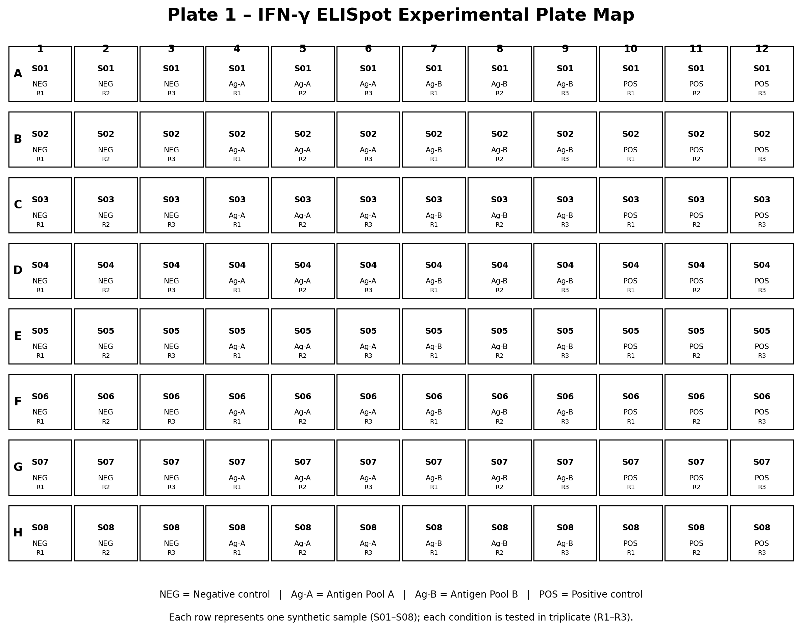
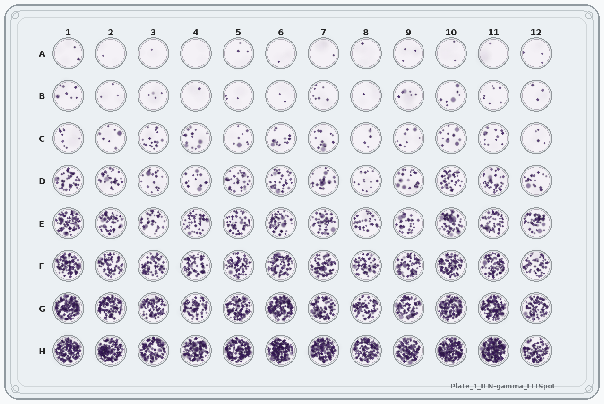
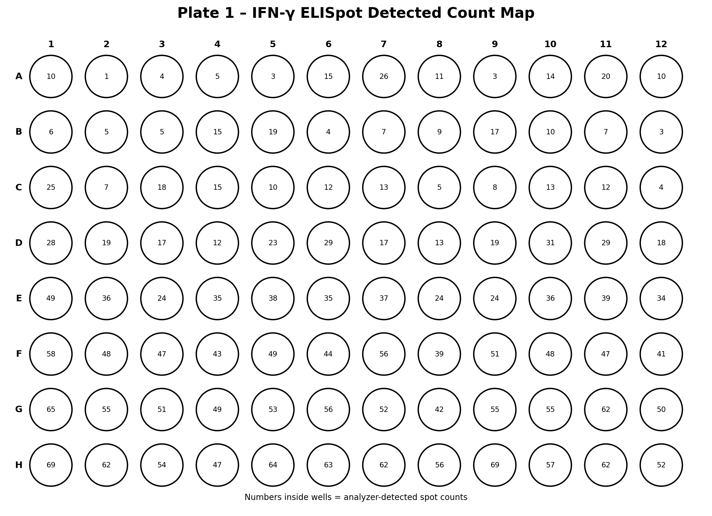
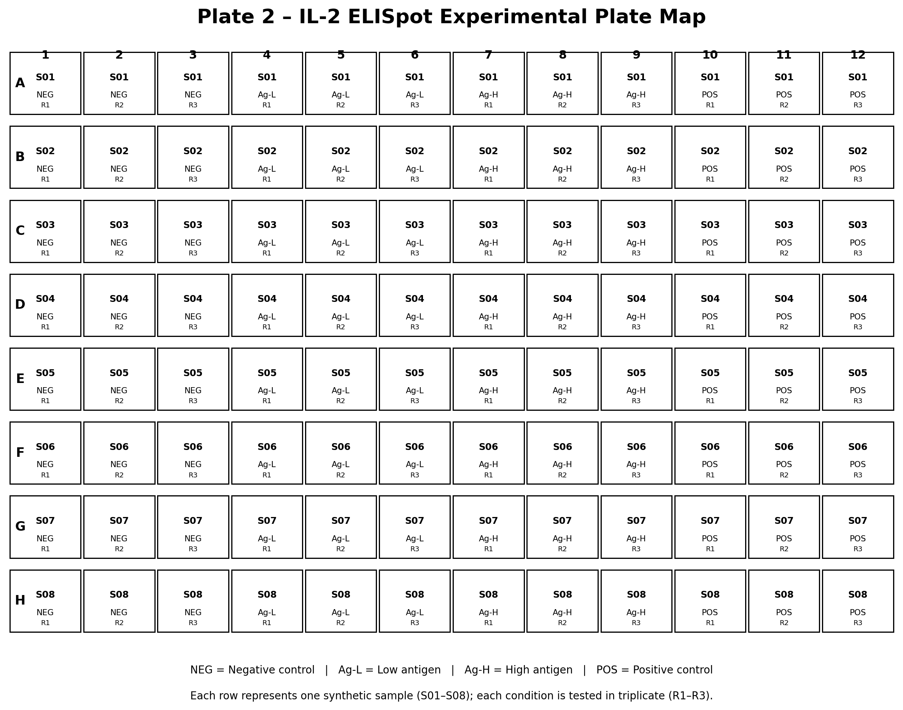
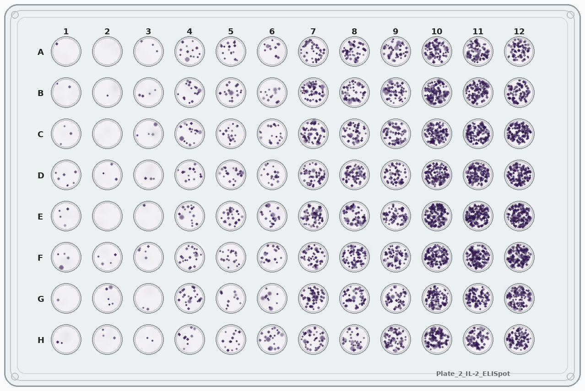
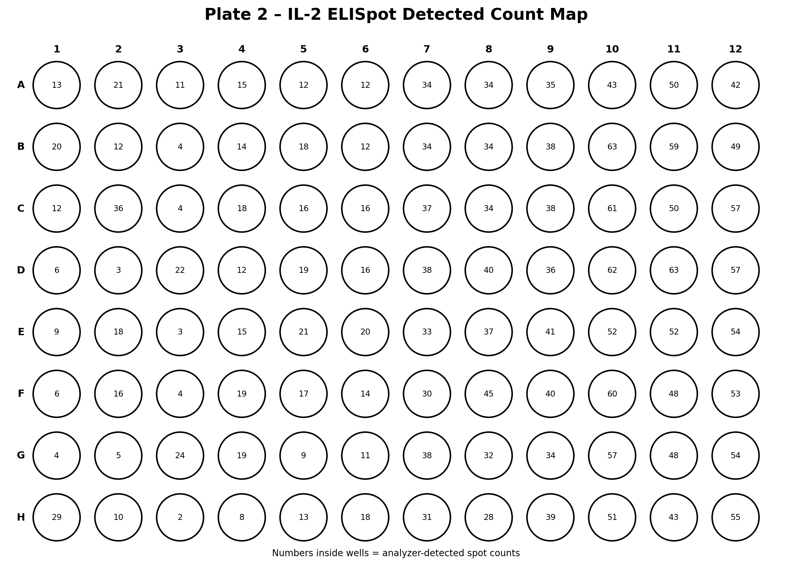
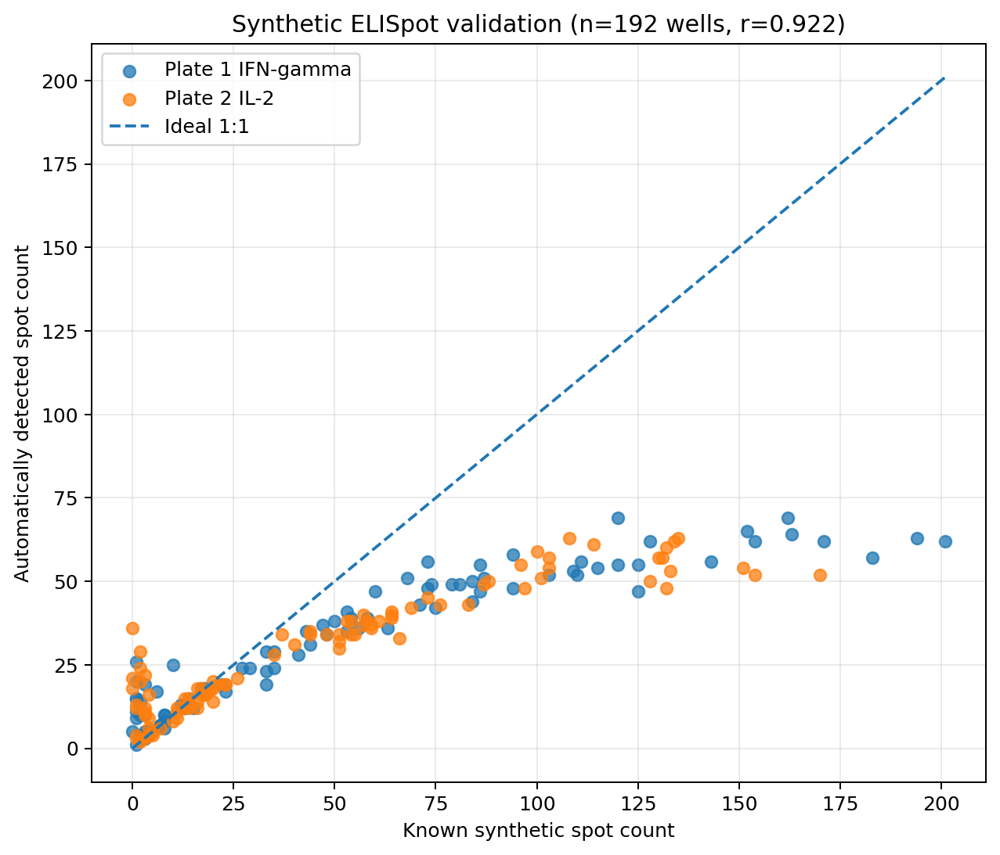

<p align="center">
  
</p>

# Wolf ELISpot Analyzer

**Automated image analysis for 96-well ELISpot assay plates**

Wolf ELISpot Analyzer is a Python module that takes a 96-well ELISpot plate image, identifies the plate and well layout, measures spot signal in each well, applies basic image-QC checks, and exports quantitative well-level results.

The project was developed as part of **Wolf Analytics**, a scientific data-analysis and automation portfolio focused on practical assay workflows, reproducible analysis, and decision-support tools.

> **Project status:** portfolio / research prototype. The included synthetic plates have known spot counts and are intended for algorithm development and validation. Results from real assay images should be independently validated before use in regulated, diagnostic, or release-testing workflows.

## Key Results

- Automated mapping and analysis of all 96 wells
- Batch processing of plate images
- Per-well spot counts, signal metrics, QC flags, and heatmaps
- Synthetic ground-truth benchmark across 192 wells
- Pearson correlation between generated and detected spot counts: **r = 0.922**

---

## Why this project matters

ELISpot analysis often relies on dedicated reader software or manual review. This project tests whether an open Python workflow can turn a standard plate image into structured, reviewable well-level data.

The practical question is simple:

**Can a standard ELISpot plate image be analyzed automatically, well by well, using open scientific Python tools?**

The initial module performs:

- automatic image loading;
- detection of the plate boundary;
- perspective correction;
- mapping of all 96 wells;
- local background estimation;
- dark-spot segmentation;
- local-intensity-peak spot counting for improved handling of crowded wells;
- connected-component area measurements;
- spot-area and integrated-darkness measurements;
- basic well-level QC flags;
- annotated-image export;
- spot-count heatmap export;
- single-image or batch-directory processing;
- CSV and JSON output; and
- validation against synthetic ground-truth data.

---

## Scientific context

ELISpot detects secreted analytes at the single-cell level. After analyte capture and development, individual secreting cells produce localized membrane spots. A useful image-analysis workflow therefore needs to distinguish true localized signal from membrane background, diffuse staining, artifacts, plate edges, and neighboring wells.

This module treats every well as an independent image-analysis region. For each well it:

1. estimates local background;
2. calculates a darkness signal relative to that background;
3. applies a robust threshold;
4. identifies local intensity peaks as candidate ELISpot events;
5. independently segments connected signal regions for area measurements; and
6. returns spot count plus supporting intensity, area, and QC metrics.

The analysis steps are kept explicit so that the assumptions can be reviewed and changed as needed.

---

## Plate geometry

The demonstration plates use a standard 96-well assay-plate footprint and an 8 × 12 well layout. The synthetic images are saved at approximately **127.8 mm × 85.5 mm** with a **9.0 mm well-to-well pitch**, matching the intended ANSI/SLAS-style geometry closely enough for controlled algorithm testing.

The software does not assume that every uploaded photograph has identical pixel dimensions. It first attempts to identify and rectify the outer plate boundary, then maps the standardized well geometry onto the rectified image.

---

## Repository structure

```text
wolf_elispot_project/
├── wolf_elispot/
│   ├── __init__.py
│   ├── analyzer.py
│   └── cli.py
├── assets/
│   ├── Plate_1_IFN-gamma_ELISpot.png
│   ├── Plate_2_IL-2_ELISpot.png
│   └── ELISpot_synthetic_ground_truth.csv
├── examples/
│   ├── analyze_two_plates.py
│   └── validate_against_ground_truth.py
├── tests/
│   └── test_geometry.py
├── main.py
├── pyproject.toml
├── requirements.txt
└── README.md
```

---

## Installation

Clone the repository and install the required packages:

```bash
pip install -r requirements.txt
```

Or install the project as a local package:

```bash
pip install -e .
```

---

## Basic use

### From Python

```python
from wolf_elispot import ELISpotAnalyzer

analyzer = ELISpotAnalyzer()

results = analyzer.analyze_image(
    image_path="my_elispot_plate.png",
    output_dir="results/my_plate",
    plate_id="experiment_001",
)
```

### From the command line

```bash
wolf-elispot my_elispot_plate.png -o results/my_plate
```

A directory of plate images can also be processed as a batch:

```bash
wolf-elispot path/to/plate_images -o results/batch_run
```

You can tune spot-detection sensitivity:

```bash
wolf-elispot my_elispot_plate.png \
    -o results/my_plate \
    --threshold-sigma 2.0 \
    --min-area 2 \
    --max-area 120
```

---

## Outputs

For every analyzed plate the module generates:

### 1. Well-level CSV

Example fields:

| Field | Meaning |
|---|---|
| `well` | Well identifier such as A1 or H12 |
| `spot_count` | Number of detected local-intensity peaks used as candidate spot events |
| `segmented_spot_area_px` | Total segmented signal area |
| `mean_component_area_px` | Mean connected-component area |
| `median_component_area_px` | Median connected-component area |
| `integrated_darkness` | Cumulative local darkness signal |
| `median_background_intensity` | Median well background intensity |
| `well_qc` | PASS or a warning flag |

### 2. Rectified plate image

The perspective-corrected plate used for analysis.

### 3. Annotated plate image

An overlay showing the 96 mapped wells and detected spot signal.

### 4. Spot-count heatmap

A plate-format visualization of detected events per well.

### 5. Analysis metadata JSON

Stores the detected plate corners and the exact analysis parameters used, supporting reproducibility and auditability.

## Example Plate Analysis

The examples below show how the experimental layout, synthetic ELISpot image, and automated analysis output fit together.

> **Note:** These layouts are illustrative synthetic designs created for portfolio demonstration. The plate images and spot distributions were generated separately, so the assigned sample conditions should not be interpreted as the cause of the observed spot patterns.

### Plate 1 – IFN-γ ELISpot

#### Illustrative experimental layout



Each row represents one synthetic sample (`S01–S08`). Conditions are organized in triplicate:

- Columns 1–3: Negative control
- Columns 4–6: Antigen Pool A
- Columns 7–9: Antigen Pool B
- Columns 10–12: Positive control

#### Synthetic ELISpot image



#### Automatically detected spot counts



---

### Plate 2 – IL-2 ELISpot

#### Illustrative experimental layout



Each row represents one synthetic sample (`S01–S08`). Conditions are organized in triplicate:

- Columns 1–3: Negative control
- Columns 4–6: Low-antigen stimulation
- Columns 7–9: High-antigen stimulation
- Columns 10–12: Positive control

#### Synthetic ELISpot image



#### Automatically detected spot counts



---

## Synthetic validation set

Two synthetic 96-well ELISpot plates are included:

- **Plate 1 – IFN-γ ELISpot**
- **Plate 2 – IL-2 ELISpot**

A companion CSV contains the known number of synthetic spots generated in every well.

This makes it possible to test the analyzer objectively rather than judging performance only by eye.

Run:

```bash
python examples/validate_against_ground_truth.py
```

The validation script compares detected counts with the known synthetic counts and reports:

- mean absolute error;
- median absolute error;
- mean relative error; and
- Pearson correlation.

Because the generated spot count is known for every well, the analyzer can be tested quantitatively and adjusted as the algorithm develops.

---

## Baseline validation results

The current v0.1 algorithm was tested against the two included synthetic plates (**192 wells total**).

- **Pearson correlation between generated and detected spot counts:** r = 0.922
- **Mean absolute error:** `24.39` spots/well
- **Median absolute error:** `14.0` spots/well



Across the synthetic benchmark, detected counts tracked generated spot counts strongly overall (Pearson r = 0.922). Absolute enumeration became progressively less accurate in crowded wells, where overlapping signals produced fewer individually resolvable intensity peaks. The current prototype therefore performs better for relative signal discrimination than for absolute spot counting at high densities. Further development will focus on separating touching/overlapping spots and improving high-density quantitation. See [`VALIDATION.md`](VALIDATION.md) for additional interpretation and the planned improvement path.

---

## Current analysis approach

### Plate detection

The program searches for a large approximately rectangular contour with an aspect ratio near the standard assay-plate footprint. If a reliable quadrilateral is found, the image is perspective-corrected.

A full-image fallback is used when the plate already fills the image.

### Well mapping

After the plate is rectified, the program first attempts to detect the circular wells and infer the 12-column × 8-row lattice automatically.

If a reliable lattice cannot be identified, the analyzer falls back to the expected standard geometry using the first-well position and 9-mm well-to-well pitch.

This provides automatic well detection while retaining a predictable fallback for standardized plate images.

### Background correction

A Gaussian-smoothed image is used as a local background estimate. Dark signal is calculated relative to the smooth background rather than by applying a single global grayscale threshold.

### Spot thresholding

A robust threshold is calculated from the median and median absolute deviation of the local darkness signal within each well.

### Spot identification

Local intensity maxima in the background-corrected darkness surface are used as candidate spot centers. This is intentionally separate from connected-component area measurement because neighboring ELISpot signals can touch or merge in dense wells. Connected components remain useful for total segmented area and artifact/QC measurements.

---

## Quality control

The module reports image- and well-level QC flags separately from biological interpretation.

Current image-level/well-level flags include:

- low-contrast wells; and
- potentially saturated or excessively dark wells.

Future versions can add:

- replicate precision;
- positive-control acceptance;
- negative-control limits;
- maximum allowable background;
- TNTC / too-numerous-to-count classification;
- plate-edge artifacts;
- merged-spot detection; and
- experiment-specific acceptance criteria.

---

## Important limitations

This is an **image-analysis research prototype**, not a validated commercial ELISpot reader.

Real ELISpot images vary substantially with:

- scanner or camera optics;
- illumination;
- membrane color;
- spot color;
- focus;
- spot morphology;
- plate manufacturer;
- image compression;
- diffuse background;
- merged spots; and
- assay development chemistry.

For real experimental use, the algorithm should be validated against representative plate images and, ideally, against manually reviewed or instrument-generated reference counts.

The current algorithm may under-count touching or highly confluent spots and may over-count textured background when thresholds are too permissive.

---

## Planned improvements

Potential next steps include:

- automatic tuning from negative-control wells;
- watershed separation of touching spots;
- morphology-based rejection of irregular artifacts;
- color-space analysis for chromogenic substrates;
- replicate grouping from a sample map;
- positive/negative control identification;
- SFU normalization per input cell number;
- plate heatmaps;
- concentration- or stimulation-response visualization;
- interactive review of flagged wells;
- batch processing of multiple plate images;
- HTML/PDF analysis reports; and
- machine-learning-assisted spot classification.

---

## What this project demonstrates

This project brings together:

**ELISpot · image analysis · assay QC · computer vision · Python · OpenCV · data automation · quantitative validation · scientific decision support**

The goal is not simply to return a spot count. The workflow keeps the analysis traceable by preserving plate geometry, well-level results, QC flags, analysis parameters, and a synthetic benchmark that can be inspected as the algorithm is improved.

---

## Author / project

**Wolf Analytics**  
Scientific Data Analysis & Automation  
March 2026 - Present

Synthetic data are used for portfolio demonstration and algorithm testing. No client, patient, or proprietary experimental data are included.
